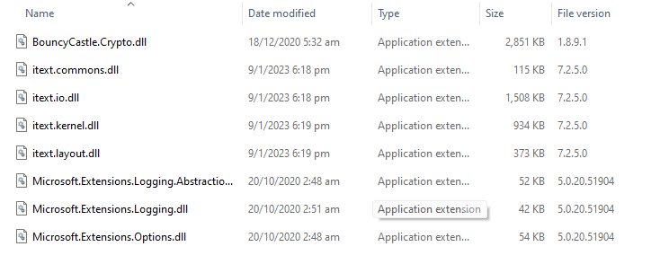

## Generating PDF using C# Web API

Code Snippet (c# Web API)

```
[Route("download")]
public HttpResponseMessage Download()
{
   MemoryStream stream = new MemoryStream();
   PdfWriter writer = new PdfWriter(stream);
   PdfDocument pdf = new PdfDocument(writer);
   Document document = new Document(pdf);

   // Header
   Paragraph header = new Paragraph("HEADER")
      .SetTextAlignment(TextAlignment.CENTER)
      .SetFontSize(20);

   // New line
   Paragraph newline = new Paragraph(new Text("\n"));

   document.Add(newline);
   document.Add(header);

   // Add sub-header
   Paragraph subheader = new Paragraph("SUB HEADER")
      .SetTextAlignment(TextAlignment.CENTER)
      .SetFontSize(15);
   document.Add(subheader);

   // Line separator
   LineSeparator ls = new LineSeparator(new SolidLine());
   document.Add(ls);

   // Add paragraph1
   Paragraph paragraph1 = new Paragraph("Lorem ipsum " +
      "dolor sit amet, consectetur adipiscing elit, " +
      "sed do eiusmod tempor incididunt ut labore " +
      "et dolore magna aliqua.");
   document.Add(paragraph1);

   // Add image
   Image img = new Image(ImageDataFactory
      .Create(@"https://staticg.sportskeeda.com/editor/2023/01/107fa-16729479671931-1920.jpg"))
      .SetTextAlignment(TextAlignment.CENTER);
   document.Add(img);

   // Table
   Table table = new Table(2, false);
   Cell cell11 = new Cell(1, 1)
      .SetBackgroundColor(ColorConstants.GRAY)
      .SetTextAlignment(TextAlignment.CENTER)
      .Add(new Paragraph("State"));
   Cell cell12 = new Cell(1, 1)
      .SetBackgroundColor(ColorConstants.GRAY)
      .SetTextAlignment(TextAlignment.CENTER)
      .Add(new Paragraph("Capital"));

   Cell cell21 = new Cell(1, 1)
      .SetTextAlignment(TextAlignment.CENTER)
      .Add(new Paragraph("New York"));
   Cell cell22 = new Cell(1, 1)
      .SetTextAlignment(TextAlignment.CENTER)
      .Add(new Paragraph("Albany"));

   Cell cell31 = new Cell(1, 1)
      .SetTextAlignment(TextAlignment.CENTER)
      .Add(new Paragraph("New Jersey"));
   Cell cell32 = new Cell(1, 1)
      .SetTextAlignment(TextAlignment.CENTER)
      .Add(new Paragraph("Trenton"));

   Cell cell41 = new Cell(1, 1)
      .SetTextAlignment(TextAlignment.CENTER)
      .Add(new Paragraph("California"));
   Cell cell42 = new Cell(1, 1)
      .SetTextAlignment(TextAlignment.CENTER)
      .Add(new Paragraph("Sacramento"));

   table.AddCell(cell11);
   table.AddCell(cell12);
   table.AddCell(cell21);
   table.AddCell(cell22);
   table.AddCell(cell31);
   table.AddCell(cell32);
   table.AddCell(cell41);
   table.AddCell(cell42);

   document.Add(newline);
   document.Add(table);

   // Hyper link
   Link link = new Link("click here",
      PdfAction.CreateURI("https://www.google.com"));
   Paragraph hyperLink = new Paragraph("Please ")
      .Add(link.SetBold().SetUnderline()
      .SetItalic().SetFontColor(ColorConstants.BLUE))
      .Add(" to go www.google.com.");

   document.Add(newline);
   document.Add(hyperLink);

   // Page numbers
   int n = pdf.GetNumberOfPages();
   for (int i = 1; i <= n; i++)
   {
         document.ShowTextAligned(new Paragraph(String
            .Format("page" + i + " of " + n)),
            559, 806, i, TextAlignment.RIGHT,
            VerticalAlignment.TOP, 0);
   }

   // Close document
   document.Close();

   var buffer = stream.ToArray();
   var contentLength = buffer.Length;
   var response = Request.CreateResponse(HttpStatusCode.OK);
   response.Content = new StreamContent(new MemoryStream(buffer));
   response.Content.Headers.ContentType = new MediaTypeHeaderValue("application/pdf");
   response.Content.Headers.ContentLength = contentLength;
   ContentDispositionHeaderValue contentDisposition = null;
   if (ContentDispositionHeaderValue.TryParse("inline; filename=export.pdf", out contentDisposition))
   {
         response.Content.Headers.ContentDisposition = contentDisposition;
   }

   return response;
}
```

Code Snippet (Javascript)

```
fetch('https://<endpoint>/api/<controller>/download')
  .then(resp => resp.blob())
  .then(blob => {
    const url = window.URL.createObjectURL(blob);
    const a = document.createElement('a');
    a.style.display = 'none';
    a.href = url;
    // the filename you want
    a.download = 'todo-1.pdf';
    document.body.appendChild(a);
    a.click();
    window.URL.revokeObjectURL(url);
  })
  .catch(() => alert('oh no!'));
```

Libraries required: 



## References:

- https://itextpdf.com/resources/downloads (Open Source)