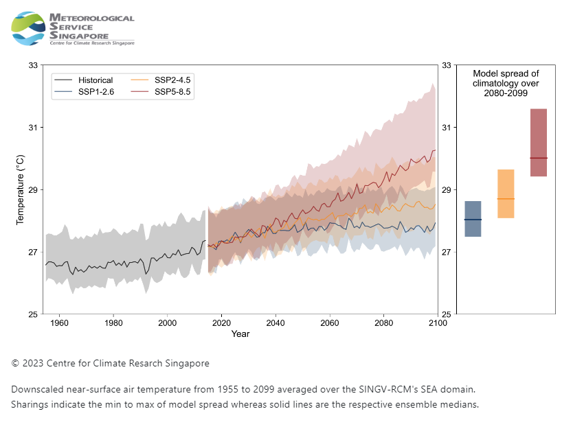

## Generating PNG using html2canvas library on the fly

Code Snippet (HTML, Javascript, Bootstrap)

```
<html>
<link rel="stylesheet" href="https://cdn.jsdelivr.net/npm/bootstrap@4.4.1/dist/css/bootstrap.min.css"
    integrity="sha384-Vkoo8x4CGsO3+Hhxv8T/Q5PaXtkKtu6ug5TOeNV6gBiFeWPGFN9MuhOf23Q9Ifjh" crossorigin="anonymous">

<body>
    <div id="imageId" class="d-flex flex-column p-3" style="width: 850px">
        
        
        <p style="font-size: 0.9rem">&copy; 2023 Centre for Climate Resarch Singapore</p>
        <p style="font-size: 0.9rem">Downscaled near-surface air temperature from 1955 to 2099 averaged over the
            SINGV-RCM's SEA domain.
            <br />Sharings indicate the min to max of model spread whereas solid lines are the respective ensemble
            medians.
        </p>
    </div>
    <div class="p-3">
        <button onclick="download()">Download</button>
    </div>
    <script src="./html2canvas.min.js"></script>
    <script>
        function download() {
            html2canvas(document.querySelector("#imageId"))
                .then(canvas => {
                    canvas.style.display = 'none'
                    canvas.crossorigin
                    document.body.appendChild(canvas)
                    return canvas;
                })
                .then(canvas => {
                    const image = canvas.toDataURL('image/png')
                    const a = document.createElement('a')
                    a.setAttribute('download', 'model.png')
                    a.setAttribute('href', image)
                    a.click()
                    canvas.remove()
                });
        }
    </script>
</body>

</html>
```

Tools:

1. Bootstrap

2. Html2Canvas

Result: 



## References:

- https://html2canvas.hertzen.com/ (Open Source)