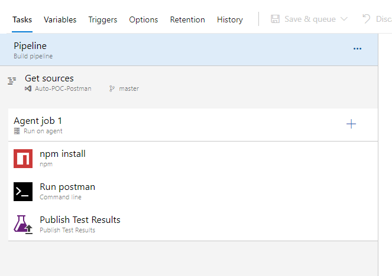
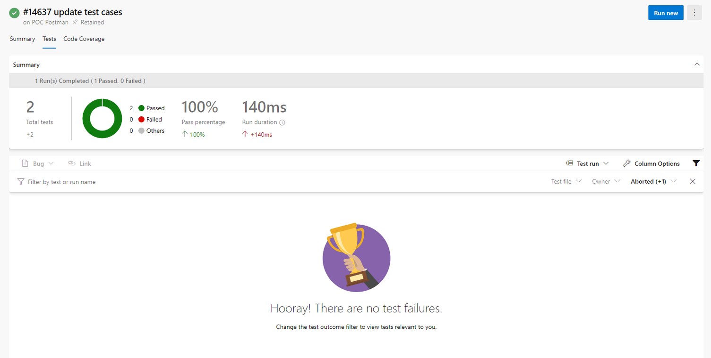

### Step 1

1.1 Create a collection

1.2 Add in a few new Requests

1.3 Write test cases for the Requests

1.4 Export Collection

### Step 2

2.1 Create a new folder

2.2 Run npm init -y

2.3 Run npm install --save newman

2.4 Create a new file .gitignore

2.5 Ignore these folders in gitignore

```
Results
node_modules
```

2.6 Copy the exported collection in step 1.4 to root

2.7 Commit and push the repository

### Step 3: Configure Azure DevOps

3.1 Create a new pipeline and reference source to the repository and branch of step 2

3.2 Source settings:

```
Clean: True
Clean options: Source
```

3.3 Create an Agent Job and select an Agent Pool

3.4 Add a NPM task

```
Command: install
Working directory: $(System.DefaultWorkingDirectory)
```

3.5 Add a Command Line task

```
Script: "./node_modules/.bin/newman" run DevOps.postman_collection.json --reporters cli,junit --reporter-junit-export Results\junitReport.xml
(environment) Script: "./node_modules/.bin/newman" run DevOps.postman_collection.json -e myenv.postman_environment.json --reporters cli,junit --reporter-junit-export Results\junitReport.xml 
Working directory: $(System.DefaultWorkingDirectory)
Continue on error: Yes
```

3.6 Add a Publish Result Task

```
Test result format: JUnit
Test results files: $(System.DefaultWorkingDirectory)\Results\*.xml 
Search folder: $(System.DefaultWorkingDirectory)
Upload test results files: Yes
```



### Step 4: Run the pipeline

### Step 5: Verify result

5.1 Tests tab will appear beside Summary tab



## References:

- https://ganeshsirsi.medium.com/how-to-configure-postman-newman-api-tests-in-azure-devops-or-tfs-and-publish-html-results-caf60a25c8b9