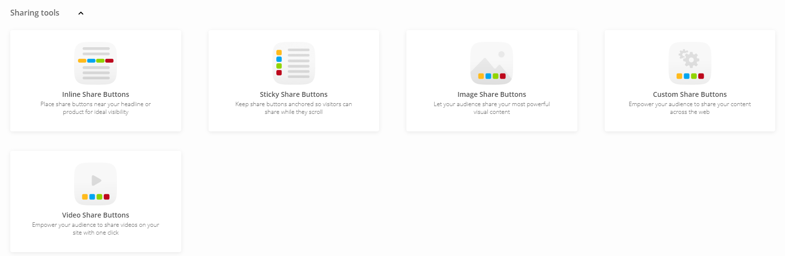
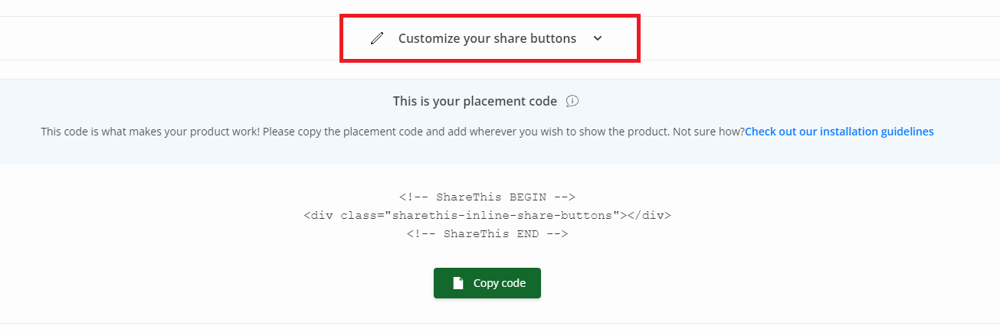
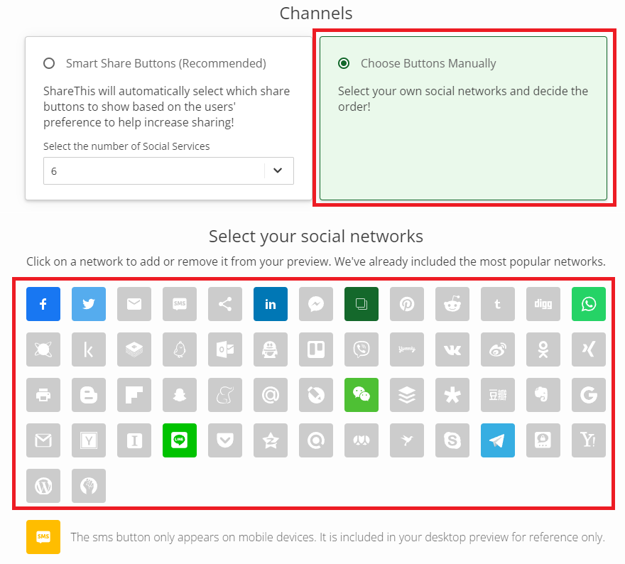
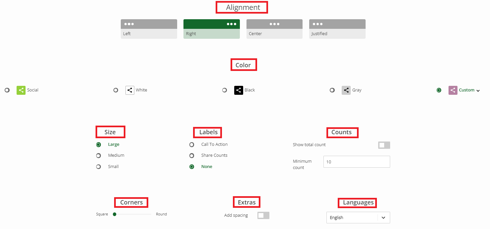
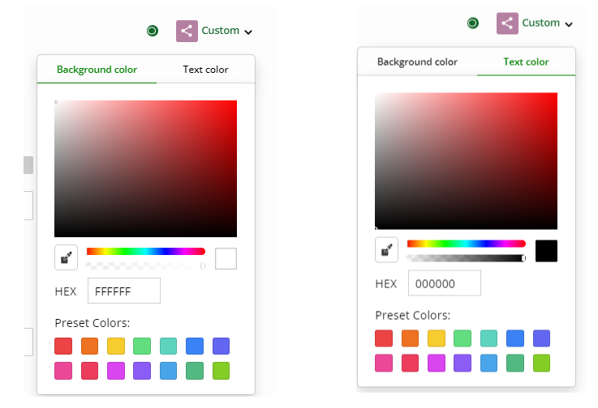
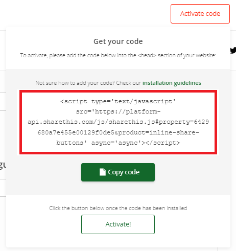
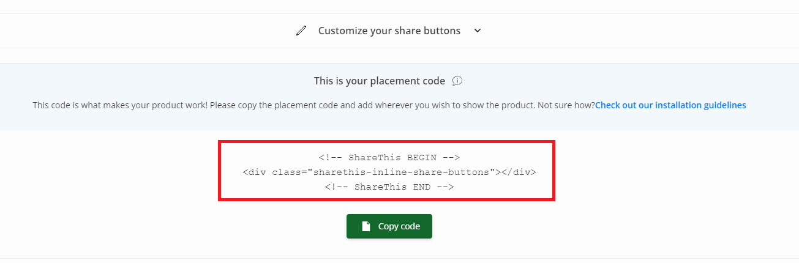

Why ShareThis?

The reason of using [ShareThis](https://sharethis.com/) as [AddThis](https://www.addthis.com/) has announced service termination end May onwards.

Hence, the team has decided to look for alternative solution and ShareThis caught our eyeballs.

## Steps to setup

1. Register an account via the [onboarding](https://sharethis.com/onboarding/)

2. Select one of the Sharing tools

 

3. In this example, we are choosing inline share buttons

4. Customize your share buttons

 

5. Select Channels - Choose Buttons Manually and choose the social networks as share icons

 

6. Customize the settings, such as alignment, color, size, labels, counts, corners, extras and language

 

7. The sample we do have 

  a/ Right alignment

  b/ Customized color for background and text color

  c/ Large size

  d/ No label, no counts, zero corners, no extra spacing

  e/ English language

 

8. Copy the code and paste to the html.

  a/ The ShareThis installation

 

  b/ The buttons code

 

9. Ensure the Content Security Policy (CSP) has whitelisted:

  a/ script-src - platform-api.sharethis.com and buttons-config.sharethis.com
  
  b/ connect-src - l.sharethis.com

  c/ img-src - platform-cdn.sharethis.com

10. Final result look

