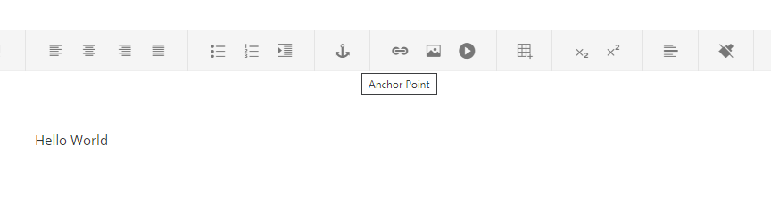
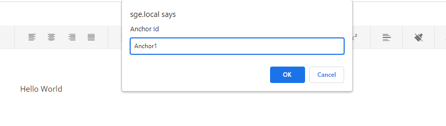
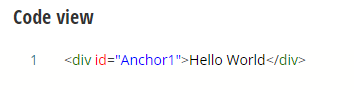

I built my first Sitefinity AdminApp Extension!

<br/>

## Problems / Issues

Sitefinity does not support out of the box insert anchor id attribute to the content block.

This is the closet I found in [documentation](https://www.progress.com/documentation/sitefinity-cms/insert-anchors-in-content-mvc)

It required dummy user to have basic HTML knowledge in order to enter the id for the content.

## My Solution

I found the sample Sitefinity AdminApp extension repository in GitHub.

I pulled it, study the code and inspect the methods I can reuse in the sample repository.

I found the sample word-count implementation is best fit to my solution.

I added an extension to ToolBarItem, it is to add a div wrapper to the content block with the prompt ID from user.

Follow the step in the sample repository, build and copy the file over to /AdminApp/ folder in the Sitefinity application.

Also, you should not to forget to add it to config.json in order to make it works.

## Sample Screen







### Code Snippet
```
  const editor = editorHost.getKendoEditor();
  const editorValue = editor.value();
  let wrapper = `<div id="ANCHOR">VALUE</div>`;

  if (jQuery(editorValue).length > 0) {
      const anchorId = prompt(`Anchor Id`);

      if (anchorId) {
          wrapper = wrapper.replace('ANCHOR', anchorId);

          if (jQuery(editorValue).length === 1) {
              wrapper = editorValue.replace(jQuery(editorValue)[0].id, anchorId);
          } else {
              wrapper = wrapper.replace('VALUE', editorValue);
          }

          editor.value(wrapper);
          editor.trigger('change');
      }
  } else if (jQuery(editorValue)) {
      const anchorId = prompt(`Anchor Id`);
      if (anchorId) {
          wrapper = wrapper.replace('ANCHOR', anchorId);
          wrapper = wrapper.replace('VALUE', editorValue);

          editor.value(wrapper);
          editor.trigger('change');
      }
  } else {
      alert('Please enter some content.');
  }
```


## What other extension can we build?

Further AdminApp extension, we can refer to the Sitefinity repository links below.


## References

- https://github.com/Sitefinity/sitefinity-admin-app-extensions


## My Code Repository

- https://github.com/hawjeh/sitefinity-admin-app-extensions-anchor-point