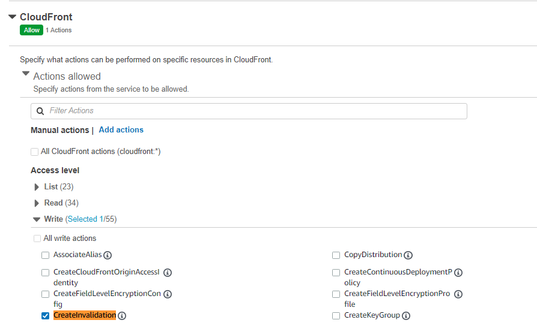

I have implemented create 
- an intercepter to listen Sitefinity Page Published event
- a cache invalidation trigger to AWS CloudFront

 

## AWS Setup

Of course CloudFront has to be already setup. 
Here we are going to setup a middleman user, to power the interface to work.

1. Create a policy <b>cf-createinvalidation-policy</b> with the permission of CreateInvalidation in CloudFront with All Resources (Wildcard)

 

2. Create user groups <b>cf-usergroup</b>, attach the policy <b>cf-createinvalidation-policy</b>

3. Create a user <b>cf-middleman</b>, add to user group <b>cf-usergroup</b>

4. Create Access keys from <b>cf-middleman</b>, choose Application running outside AWS and name it as <b>cf-sf</b>

5. Use the access keys to run the code later

 

## Sitefinity

I built it as a seperated module in order to plug and play in different solution and version.

You can follow the [steps](https://www.progress.com/documentation/sitefinity-cms/create-widgets-in-external-assemblies-mvc) to setup external library to plug in and play on Sitefinity.

1. In last line of _AssemblyInfo.cs_ file, insert

  `[assembly: PreApplicationStartMethod(typeof(SparksEventSubscriber), "Start")]`

2. Create a [_SparksEventSubscriber.cs_](https://gist.github.com/hawjeh/46775333e616621cf8a4bba2692f9c01#file-sparksappsetting-cs) file, and a [_SparksEventSubscriber.cs_](https://gist.github.com/hawjeh/46775333e616621cf8a4bba2692f9c01#file-sparkseventsubscriber-cs) file 

3. Create a _sparksSetting.json_ file 

  `
  {
    "CloudFront": {
      "Profile": "",
      "DistributionId": "",
      "AccessKeyId": "",
      "AccessKey": ""
    }
  }
  `

4. Build the project

5. For deployment, copy AWSSDK.CloudFront.dll, AWSSDK.Core.dll (if missing from destination), SparksCloudFront.dll and sparksSetting.json to Sitefinity Project

6. Edit the sparksSetting.json to the relevant project credentials

Finally, go to one of the Page setup in Sitefinity instance, publish and you will see all relevant URLs will be submit for Cache Invalidation.

 

### How to upgrade or download for different Sitefinity version?

Very simple, just go to _Manage Nuget Packages_ screen, change the package source to _[Sitefinity NuGet Source](https://www.progress.com/documentation/sitefinity-cms/sitefinity-cms-nuget-packages-repository)_

Update _Telerik.Sitefinity.Core_ to the desired version.

 

## Documentation / References:

- https://community.progress.com/s/article/How-to-catch-the-Publish-Unpublish-and-Save-as-draft-events-using-API
- https://www.progress.com/documentation/sitefinity-cms/configure-cdn-cache-invalidation
- https://www.progress.com/documentation/sitefinity-cms/for-developers-idataevent
- https://docs.aws.amazon.com/sdkfornet/v3/apidocs/items/CloudFront/MCloudFrontCreateInvalidationCreateInvalidationRequest.html