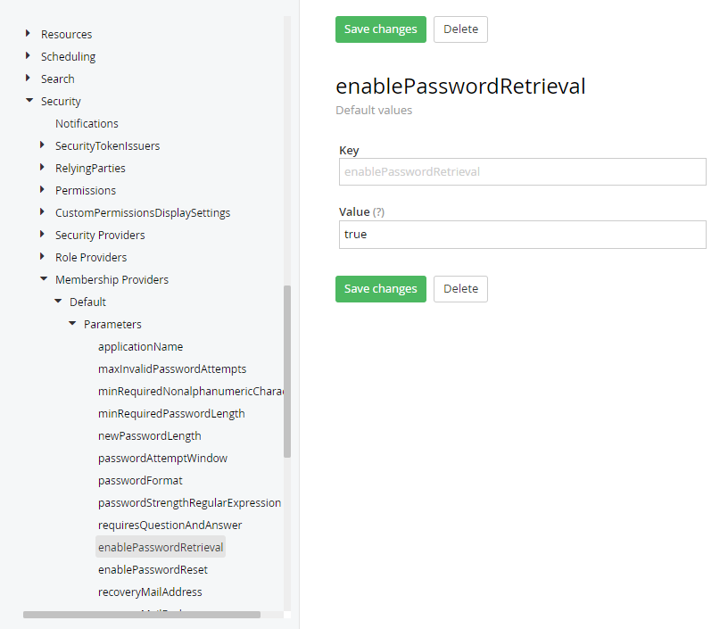

I built a custom reset password screen for Sitefinity!

Tested and running in V13.

 

## Problems / Issues

Sitefinity does not come with a reset password screen.

Hence we have to build a custom widget + content type to support it.

All codes can be found in my snippets.

 

## My Solution

1. Modify and place the [login.html](https://gist.github.com/hawjeh/c8daf9367fa84c4777cca341d6750a42#file-content_pages_login-html) to Sitefinity folder (Content/Pages/login.html)

2. Create a custom module to hold request id and user id.
This is to hold the temporary request id and user id for password reset verification.

 

The content type structure

 

Hide the content page from showing in navigation. (at backendpages)

 

3. Configure SMTP Profile.

 

4. Configure advanced setting

Configure Security/Membership Providers/Default/Parameters/<b>enablePasswordRetrieval</b> to <b>true</b>

Configure Security/Membership Providers/Default/Parameters/<b>enablePasswordReset</b> to <b>true</b>

 

5. Add [Custom Code](https://gist.github.com/hawjeh/c8daf9367fa84c4777cca341d6750a42#file-global-asax-cs) to Global.asax.cs

6. Setup a Forgot Password Page in Pages

 

Select a default MVC Page

 

Install the ForgotPassword widget

 

7. Reset password screen:

 

 

Then receive password reset link in email

 

It will route to the change password screen

 

 

Then back to login screen to login and test the login.

 

## References

- https://community.progress.com/s/article/how-to-add-reset-password-link-to-backend-login-page 
- https://community.progress.com/s/article/this-operation-requires-iis-integrated-pipeline-mode-error-when-using-antiforgerytoken  

## My Code Snippets

- https://gist.github.com/hawjeh/c8daf9367fa84c4777cca341d6750a42