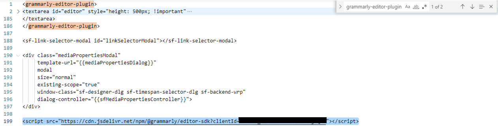
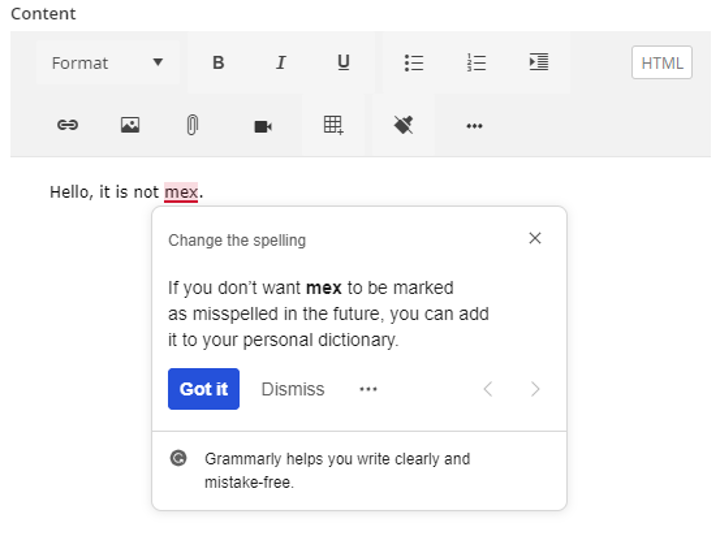
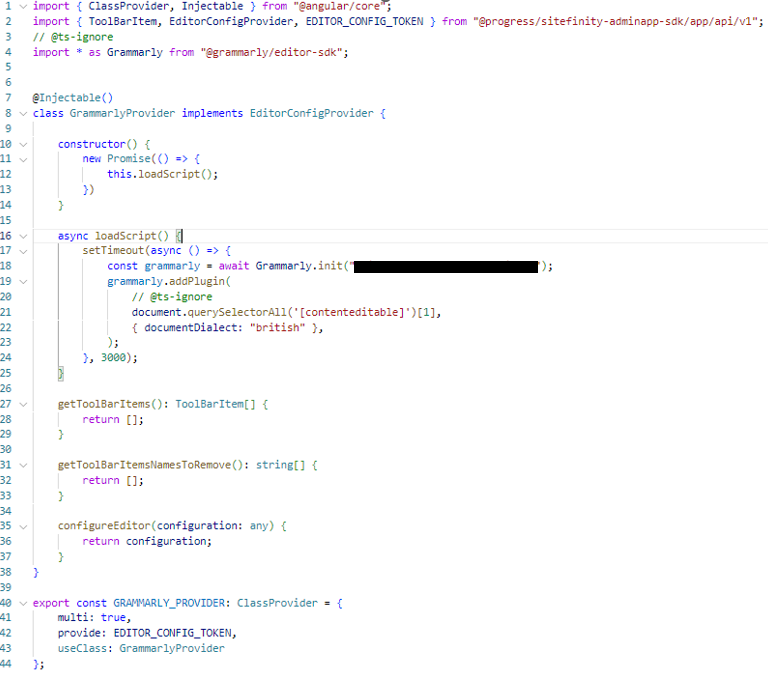
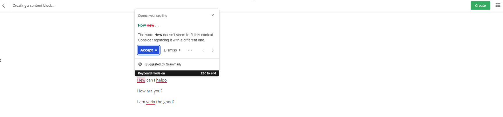

## Background Story

We want to have grammar check while user editing the content.


How we do that?

Firstly, we register a Grammarly account at https://developer.grammarly.com/ 

Add allowed domain of the Sitefinity instance.

Copy the client id as we are going to follow this approach: https://developer.grammarly.com/docs/editor-sdk-intro#usage

With the html tag and script.

```
<grammarly-editor-plugin>
  <textarea></textarea>
</grammarly-editor-plugin>

<script src="https://cdn.jsdelivr.net/npm/@grammarly/editor-sdk?clientId=YOUR_CLIENT_ID"></script>
```

Also pre-requisite for CMS, adding content security policy (CSP) rule:

<b>script sources</b>

```
cdn.jsdelivr.net
*.grammarly.com
```

<b>connect sources</b>

```
*.grammarly.com
*.grammarly.io
wss://capi.grammarly.com
```

<br/>
<br/>

Two places to amend, the custom sf-html-field and the adminapp

<br/>
1/ In the custom sf-html-field.sf-cshtml, added the Grammarly wrapper and script to Grammarly



Result at pop up editing RTE:



<br/><br/>
2/ Custom provider at AdminApp to inject the scripts



<br/>
Result at the AdminApp powered RTE:

