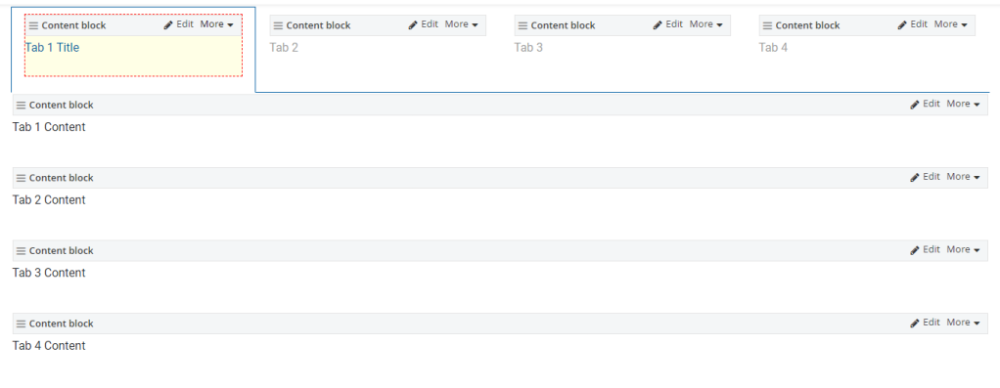

Overkill Tab Layout:

1. Support 7 Tabs
2. Use css class: d-none to hide tab 4 – tab 7 by default

## Widget Editing screen:

## Editing Screen:

## Actual Screen:

## My Sample Code
- https://gist.github.com/hawjeh/0a021153fea4a063f3f65b134b9aab75