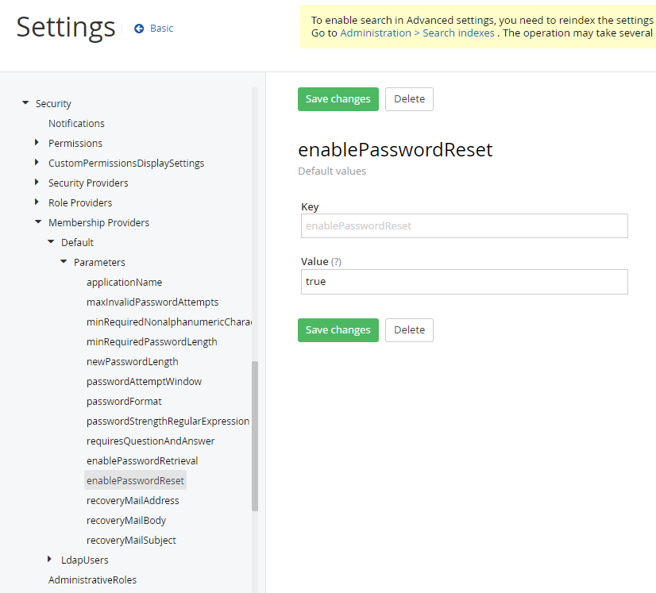
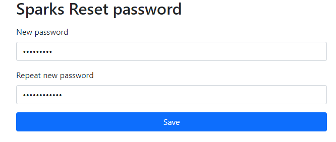

I configure the OOTB reset password screen for Sitefinity!

Tested and running in v13.3 and V14.4.

 

## Problems / Issues

[Previously](https://www.hawjeh.com/blog/sitefinity-custom-reset-password) we have made a mistake about Sitefinity reset password screen.

Today, the article is to showcase the step to configure the reset password screens.

It is slightly different between v14+ and v13 or below when setting up the screen.

Also, the workflow is slightly different if you want to reset password for public user and backend dashboard admin user.

In this article, we will focus on the backend dashboard admin user.

 

## Pre-requisite for the Solution

1. Set Security/Membership Provders/Default/Parameters/enablePasswordReset to true
(Please restart core Sitefinity after configuration updated)

 

2. Setup SMTP profile
 

## Solution for v14+ with net core renderer

1. Create a page for reset password

 

2. You can either a) Use the OOTB template

The login form

The reset password form

The change password form

 

3. or b) customize the template when setting up the page.

Get the Default template from 
- [SitefinityLoginForm](https://github.com/Sitefinity/sitefinity-aspnetcore-mvc-widgets/blob/master/Progress.Sitefinity.AspNetCore.Widgets/Views/Shared/Components/SitefinityLoginForm/Default.cshtml)
- [SitefinityResetPassword](https://github.com/Sitefinity/sitefinity-aspnetcore-mvc-widgets/blob/master/Progress.Sitefinity.AspNetCore.Widgets/Views/Shared/Components/SitefinityResetPassword/Default.cshtml)
- [SitefinityChangePassword](https://github.com/Sitefinity/sitefinity-aspnetcore-mvc-widgets/blob/master/Progress.Sitefinity.AspNetCore.Widgets/Views/Shared/Components/SitefinityChangePassword/Default.cshtml)

 

4. Clone to the project, and name it as Sparks*

 

5. Deploy the widget, and select the override template

 

6. Go to the backendpages /Sitefinity/Administration/BackendPages/Pages and Edit the login page under authentication

 

7. Update the <b>ChangePasswordPageUrl</b> and set <b>ShowLostPasswordLink</b> as True
The ChangePasswordPageUrl follow the reset password page that you have created in step 1.

 

8. Visit /Sitefinity page and in the Login page, it will show <b>Forgot your password?</b> link.

 

9. Click and follow the link to the the Forgot password screen, then submit

 

10. You will receive an email.

 

11. Click and follow the link to reset password. Key in new password and see the password changed successful screen!

 

12. For the customization of email template, can refer to [here](https://www.progress.com/documentation/sitefinity-cms/tutorial-customize-the-email-notification-for-password-change#customize-the-email-template-body) too

 
 

## Solution for v13.3 with Bootstrap 4 or 5 

1. Create 1 page for Reset Password, choose Boostrap 4 or 5 page template.
Install <b>Login Form</b> widget and edit it.
Mark a tick for <b>Allow users to reset password</b>

 

2. The published page and get the forget password url, e.g. `http://<domain>/auth/resetpassword`
(Be-aware to use the correct url, its a multi-views widget, hence, the reset password screen may require another /resetpassword)

3. Then go to the backendpages /Sitefinity/Administration/BackendPages/Pages,
Edit the login page under authentication

 

4. Update the <b>ChangePasswordPageUrl</b> and set <b>ShowLostPasswordLink</b> as True
The ChangePasswordPageUrl follow the reset password page that you have created in step 1.

 

5. Publish the page, and go to /Sitefinity/Login and in the Login page, it will show <b>Forgot your password?</b> link.

 

6. Click and follow the link to the the Forgot password screen, then submit

 

7. You will receive an email.

 

8. Click and follow the link to reset password. Key in new password and see the password changed successful screen!

 

9. You may also want to customize the Templates to correct URL.

 

## References

- https://www.progress.com/documentation/sitefinity-cms/reset-password-widget
- https://github.com/Sitefinity/sitefinity-aspnetcore-mvc-widgets