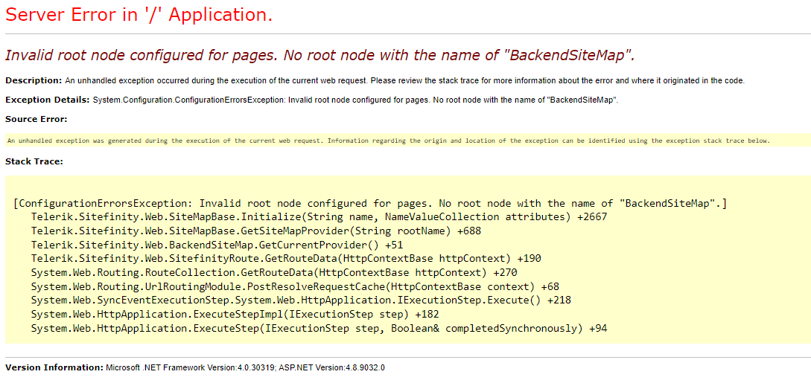
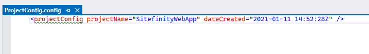

## Intro

Replace "name" with SitefinityWebApp

Error: Invalid root node configured for pages.




### Steps to execute script:

<b>Pre-requisite: Create a backup of the site database before the rest of the steps</b>

1/ Change the name in App_Data/Sitefinity/Configuration folder in file <b>ProjectConfig.config</b> to the new desired project name.
Sample: In this example, it is "SitefinityWebApp"


<br />

2/ Ensure there is no duplicate <b>ProjectConfig.config</b> in the database by checking with this query:

```
select * from sf_xml_config_items
where path = 'ProjectConfig.config'
```

If there is another copy of ProjectConfig.config in [sf_xml_config_items] and the property projectName is there, make sure to apply the change also there.
<br />

3/ After this check what is the actual project name (the one that must be changed) saved in the database by using this query:

```
select app_name from sf_schema_vrsns
```

The result of the query will show what is the current project name that must be changed. Note, the name will be followed by ' / '.
The project name follows the naming convention <b>"any name"</b> there is a slash at the end.
<br />

4/ Use an automated script to change the value of the app_name in all tables, for example, this script:

```
SET NOCOUNT ON
 
DECLARE @stringToFind VARCHAR(100)
DECLARE @stringToReplace VARCHAR(100)
DECLARE @schema sysname
DECLARE @table sysname
DECLARE @count INT
DECLARE @sqlCommand VARCHAR(8000)
DECLARE @where VARCHAR(8000)
DECLARE @columnName sysname
DECLARE @object_id INT
                      
SET @stringToFind = 'cwp-sf-base'
SET @stringToReplace = 'SitefinityWebApp'
                         
DECLARE TAB_CURSOR CURSOR  FOR
SELECT   B.NAME      AS SCHEMANAME,
         A.NAME      AS TABLENAME,
         A.OBJECT_ID
FROM     sys.objects A
         INNER JOIN sys.schemas B
           ON A.SCHEMA_ID = B.SCHEMA_ID
WHERE    TYPE = 'U'
ORDER BY 1
           
OPEN TAB_CURSOR
 
FETCH NEXT FROM TAB_CURSOR
INTO @schema,
     @table,
     @object_id
       
WHILE @@FETCH_STATUS = 0
  BEGIN
    DECLARE COL_CURSOR CURSOR FOR
    SELECT A.NAME
    FROM   sys.columns A
           INNER JOIN sys.types B
             ON A.SYSTEM_TYPE_ID = B.SYSTEM_TYPE_ID
    WHERE  OBJECT_ID = @object_id
           AND IS_COMPUTED = 0
           AND B.NAME IN ('char','nchar','nvarchar','varchar','text','ntext')
 
    OPEN COL_CURSOR
      
    FETCH NEXT FROM COL_CURSOR
    INTO @columnName
      
    WHILE @@FETCH_STATUS = 0
      BEGIN
        SET @sqlCommand = 'UPDATE ' + @schema + '.' + @table + ' SET [' + @columnName
                           + '] = REPLACE(convert(nvarchar(max),[' + @columnName + ']),'''
                           + @stringToFind + ''',''' + @stringToReplace + ''')'
          
        SET @where = ' WHERE [' + @columnName + '] LIKE ''%' + @stringToFind + '%'''
          
        EXEC( @sqlCommand + @where)
          
        SET @count = @@ROWCOUNT
          
        IF @count > 0
          BEGIN
            PRINT @sqlCommand + @where
            PRINT 'Updated: ' + CONVERT(VARCHAR(10),@count)
            PRINT '----------------------------------------------------'
          END
          
        FETCH NEXT FROM COL_CURSOR
        INTO @columnName
      END
      
    CLOSE COL_CURSOR
    DEALLOCATE COL_CURSOR
      
    FETCH NEXT FROM TAB_CURSOR
    INTO @schema,
         @table,
         @object_id
  END
    
CLOSE TAB_CURSOR
DEALLOCATE TAB_CURSOR
```
<br />

5/ Restart the site in order to apply the changed.
<br />

6/ Test if all modules in the site open up and work properly. Changing the project name impacts the ability for a Sitefinity module to work.
<br />

7/ Open all modules in Sitefinity backend (all backend screens) and if no errors are shown the process is completed.

<br /><br />

## References:

- https://community.progress.com/s/article/How-to-rename-app-name