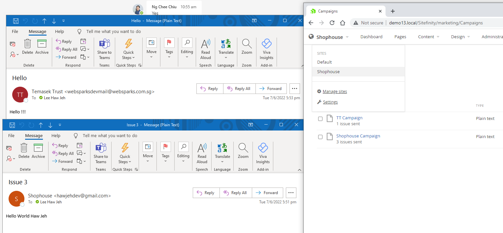

## <b>The goal</b>

To use different SMTP profiles in Sitefinity for different marketing campaigns.

## <b>The testing tool</b>

- Sitefinity V13
- Websparks development email
- My Gmail

## <b>Configuration</b>

Setup SMTP (notification) profiles in Sitefinity.

In this demo, my profiles are Default and Shophouse


<br/><br/>

Make sure that <i>SenderType</i> is point to the class of the custom code, in this demo, it is <i>SitefinityWebApp.Utils.CustomSmtpSender</i>


<br/><br/>

## <b>Custom Code Snippets</b>

```
using System;
using System.Linq;
using System.Net.Mail;
using System.Text;
using Telerik.Sitefinity.Services;
using Telerik.Sitefinity.Services.Notifications;
using Telerik.Sitefinity.Services.Notifications.Composition;
using Telerik.Sitefinity.Services.Notifications.Configuration;
using Telerik.Sitefinity.Services.Notifications.Smtp;

// Telerik.Sitefinity.Services.Notifications.Smtp.SmtpSender
namespace SitefinityWebApp.Utils
{
    public class CustomSmtpSender : SmtpSender
    {
        public CustomSmtpSender(SmtpSenderProfileElement senderProfile) : base(senderProfile) { }

        public override SendResult SendMessage(IMessageInfo messageInfo, ISubscriberRequest subscriber)
        {
            var context = new ServiceContext(string.Empty, "EnquiryEmail");
            var profiles = SystemManager.GetNotificationService().GetSenderProfiles(new QueryParameters());
            var profile = profiles.ToList().Where(x => x.CustomProperties["username"] != null).FirstOrDefault(x => x.CustomProperties["username"].Equals(messageInfo.SenderEmailAddress));

            // Sender email address must map to notification profile
            if (profile == null)
            {
                return SendResult.ReturnFailed(new Exception("SMTP Sender Profile Not Found"));
            }

            var smtpServer = new SmtpClient
            {
                Host = profile.CustomProperties["host"],
                Port = Convert.ToInt32(profile.CustomProperties["port"]),
                EnableSsl = Convert.ToBoolean(profile.CustomProperties["useSSL"]),
                DeliveryMethod = SmtpDeliveryMethod.Network,
                Credentials = new System.Net.NetworkCredential(profile.CustomProperties["username"], profile.CustomProperties["password"])
            };

            // Customize code from SmtpSender
            using (MailMessage mailMessage = new MailMessage())
            {
                string address = ((!messageInfo.SenderEmailAddress.IsNullOrEmpty()) ? messageInfo.SenderEmailAddress : ((!messageInfo.TemplateSenderEmailAddress.IsNullOrWhitespace()) ? messageInfo.TemplateSenderEmailAddress : profile.CustomProperties["defaultSenderEmailAddress"]));
                string displayName = ((!messageInfo.SenderName.IsNullOrEmpty()) ? messageInfo.SenderName : ((!messageInfo.TemplateSenderName.IsNullOrWhitespace()) ? messageInfo.TemplateSenderName : ((!profile.CustomProperties["defaultSenderEmailAddress"].IsNullOrEmpty()) ? profile.CustomProperties["defaultSenderEmailAddress"] : profile.CustomProperties["defaultSenderEmailAddress"])));
                mailMessage.From = new MailAddress(address, displayName);
                try
                {
                    string obj = subscriber.FirstName ?? string.Empty;
                    string text = string.Concat(str2: (subscriber.LastName ?? string.Empty).Trim(), str0: obj.Trim(), str1: " ").Trim();
                    if (!text.IsNullOrEmpty())
                    {
                        mailMessage.To.Add(new MailAddress(subscriber.Email.Trim(), text));
                    }
                    else
                    {
                        mailMessage.To.Add(new MailAddress(subscriber.Email.Trim()));
                    }
                }
                catch (Exception exception)
                {
                    return SendResult.ReturnFailedRecipient(exception);
                }

                mailMessage.Subject = messageInfo.Subject;
                string text2 = MessageSubjectEncoding;
                if (string.IsNullOrEmpty(text2))
                {
                    text2 = "utf-8";
                }

                mailMessage.SubjectEncoding = Encoding.GetEncoding(text2);
                string text3 = MessageBodyEncoding;
                if (string.IsNullOrEmpty(text3))
                {
                    text3 = "utf-8";
                }

                mailMessage.BodyEncoding = Encoding.GetEncoding(text3);
                if (messageInfo.PlainTextVersion != null)
                {
                    AlternateView item = AlternateView.CreateAlternateViewFromString(messageInfo.PlainTextVersion, null, "text/plain");
                    mailMessage.AlternateViews.Add(item);
                }

                if (messageInfo.BodyHtml != null)
                {
                    AlternateView item2 = AlternateView.CreateAlternateViewFromString(messageInfo.BodyHtml, null, "text/html");
                    mailMessage.AlternateViews.Add(item2);
                }

                mailMessage.IsBodyHtml = messageInfo.IsHtml;
                AddMessageHeaders(messageInfo, mailMessage);
                try
                {
                    smtpServer.Send(mailMessage);
                }
                catch (SmtpFailedRecipientException exception2)
                {
                    return SendResult.ReturnFailedRecipient(exception2);
                }
                catch (SmtpException ex)
                {
                    if (ex.StatusCode == SmtpStatusCode.MailboxUnavailable || ex.StatusCode == SmtpStatusCode.MailboxBusy || ex.StatusCode == SmtpStatusCode.SyntaxError || ex.StatusCode == SmtpStatusCode.LocalErrorInProcessing || ex.StatusCode == SmtpStatusCode.UserNotLocalTryAlternatePath)
                    {
                        return SendResult.ReturnFailedRecipient(ex);
                    }

                    return SendResult.ReturnFailed(ex);
                }
                catch (Exception exception3)
                {
                    return SendResult.ReturnFailed(exception3);
                }
            }

            return SendResult.ReturnSuccess();
        }
    }
}
```

## <b>Marketing Campaign Setting</b>

When creating a campaign, use the email username that you have setup in Notification Configuration


## <b>Imperfectus</b>

Sitefinity marketing campaign is a global / shared OOTB module. It is shared across multi-sites.

Backend CMS users from different sites may see campaigns from other sites.

Therefore, standard naming convention is important to differentiate the campaign from different user groups.

## <b>Final Screen</b>




## References:

- https://knowledgebase.progress.com/articles/Article/How-to-Extend-Sitefinity-SmtpSender
- https://knowledgebase.progress.com/articles/Article/how-to-set-smtp-sender-in-sitefinity-with-google-smtp-gmail-com