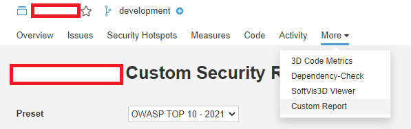
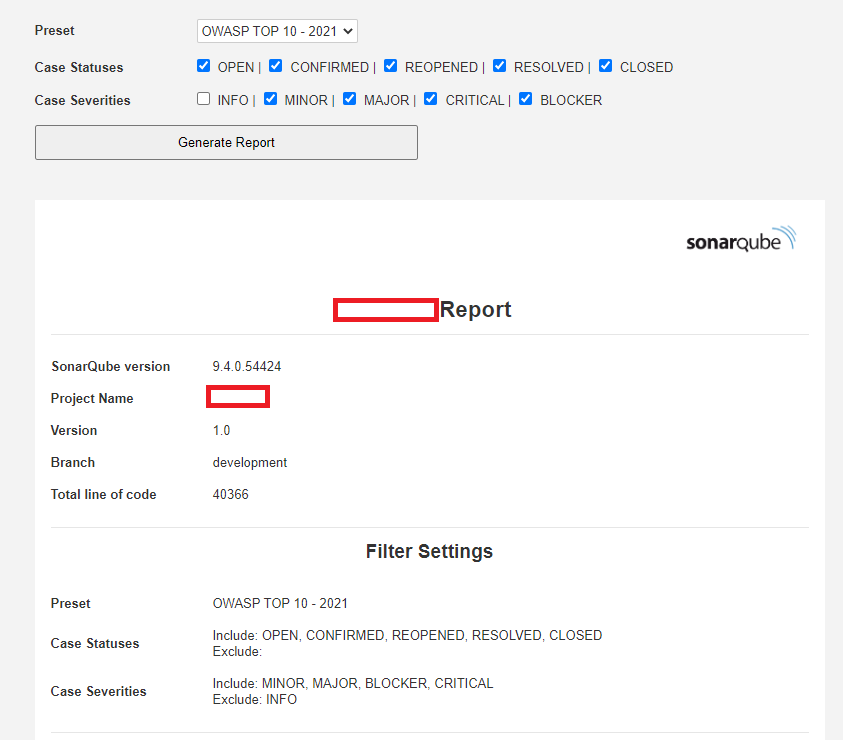

I built my first SonarQube plugin!

 

## What is the reason I build a module?

Recently, my company has an initiative to integrate SAST tool into CICD pipeline. 
We have been looking at Fortify, SonarQub and etc.
Fortunately, I am taking part in the SonarQube research part :)

We first discovered [CNES plugin](https://github.com/cnescatlab/sonar-cnes-report) but it does not really covered all the cases that we wanted to see.
Therefore, we decided to re-invent the wheel!

## Why I re-invent the wheel?

Actually there is a built in report tool, unfortunately, it only available in the [Enterprise Edition](https://www.sonarqube.org/enterprise-edition/)
As a developer myself, I am more bias to the community basis version and FREE! :)

## How I get start and learn about it?

I pulled the CNES report, to seek a chance to amend the report.
However, the current (as of end April 2022) version doesnt support OWASP 2021 report, it only by the upgraded (I believe is 9.x) version.
Then, I go ahead and pull the sonar custom plugin example repo, study and learn about it.

I discovered that the Java code is a wrapper to plug into sonarqube system, which I believe is based on Java too. (of course they use other plugins like elasticsearch, etc).
I also discovered that there is a bunch of RESTful Web Api available out of the box!
Although it is very confusing in certain case, I managed to find out by visiting different pages in the SonarQube dashboard itself.

## How I build it?

I am not a Java developer, therefore, my custom security report is purely based on React code with API calls.
You can check [my repository](https://github.com/hawjeh/sonar-custom-plugin-example-report), my code is under /src/main/js.
I forked out from the sample code repository, remained the sample code and hacked some of the Java & Javascript code to show only my plugin.
I will need to pull from the base repository in order to upgrade it in future~

## How is the plugin looks like?

Access point:

Report:

Sample Report:
Unfortunately, it contains client's data, I cant show it here..
But, no worry, just get your hand dirty and pull my code :)
You will be able to see how it works!

 

## My Repository and References

- [My Repository](https://github.com/hawjeh/sonar-custom-plugin-example-report)
- https://docs.sonarqube.org/latest/extend/developing-plugin/
- https://github.com/SonarSource/sonar-custom-plugin-example
- https://github.com/cnescatlab/sonar-cnes-report 